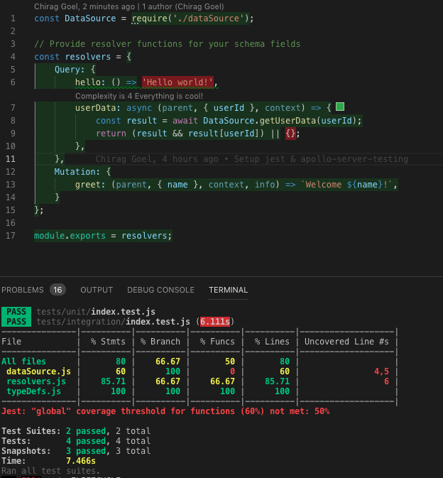

## Apollo Graphql Server Testing

Unit & Integration testing using `apollo-server-testing` and `jest`. [Read the docs](https://www.apollographql.com/docs/apollo-server/testing/testing/)

### Run test cases
```shell
npm run test
```

### Check coverage
```shell
npm run test:coverage
```

### Highlight code coverage in VSCode
You can use `Code Coverage` [extension](https://marketplace.visualstudio.com/items?itemName=markis.code-coverage)





Author: [Chirag Goel](http://www.chirag-goel.in)